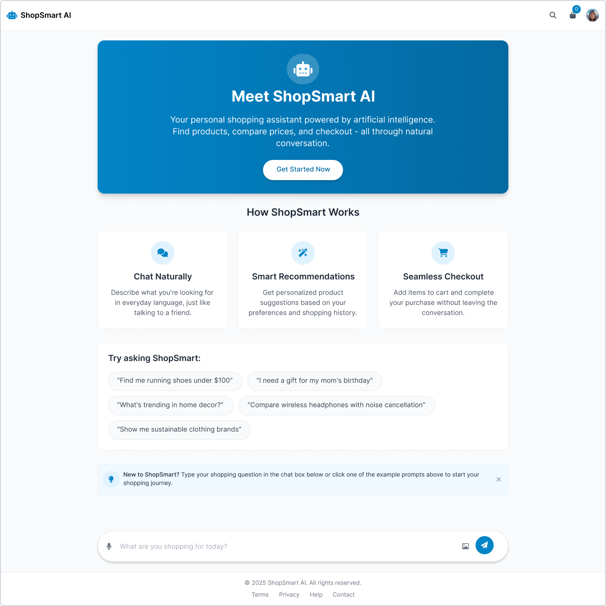
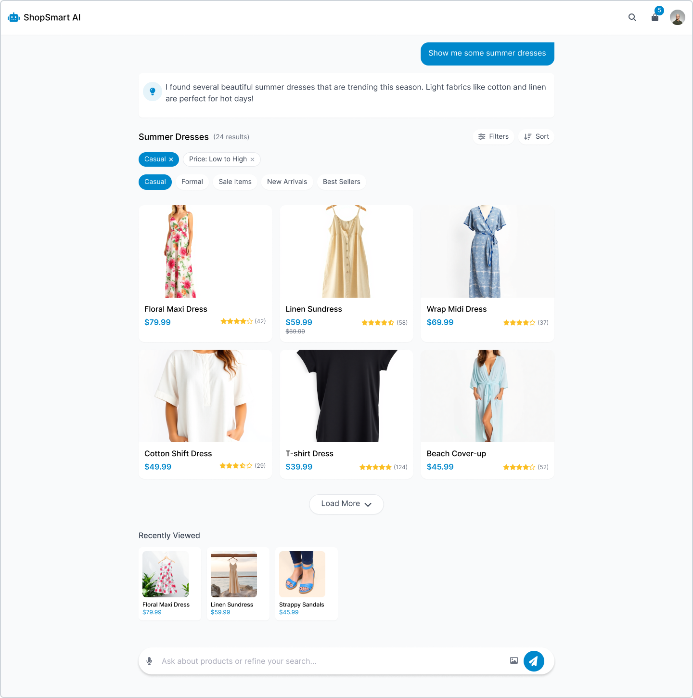
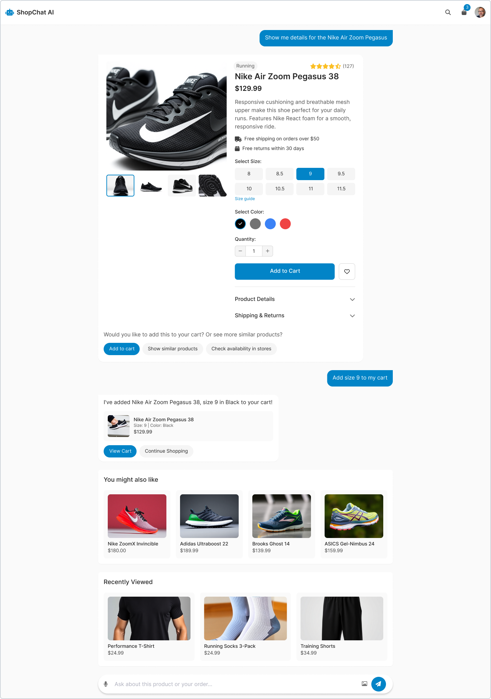
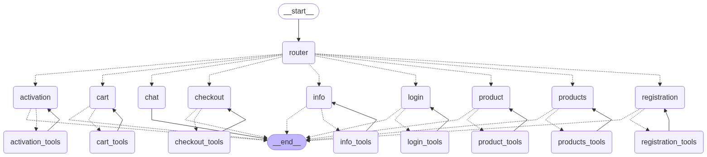

# Cognito

Modern AI-powered agentic e-commerce platform, designed to autonomously handle complex commerce operations.

**Open Source Software** - Licensed under the Functional Source License (FSL). Free to use and modify.

**Demo app link:** TBA

## Design Vision

Below are the reference designs that showcase how the platform should look and feel:

**Home Page**


**Product Listing**


**Product Page**


For more details about the template system and customization, see [template/README.md](./template/README.md).

## Project Overview

Cognito is an innovative **agentic e-commerce platform** that leverages artificial intelligence and autonomous agents to enhance the shopping experience. Unlike traditional e-commerce systems, Cognito uses AI agents to handle complex workflows, customer interactions, and business processes autonomously.

### AI Agents Architecture



The platform uses LangGraph to implement a multi-agent system where specialized AI agents autonomously handle different aspects of e-commerce operations. For detailed architecture documentation, see [docs/AGENTS.md](docs/AGENTS.md).

### AI Ideas & Planned Features

The platform will leverage multiple AI models to create an intelligent, safe, and autonomous e-commerce experience:

**Conversational Ecommerce Experience**
- **AI Chat Interface** - Natural language product discovery and purchase through conversational AI
- **Personalized Recommendations** - Context-aware product suggestions based on conversation
- **Smart Shopping Assistant** - Autonomous agent to guide customers through their shopping journey

**Content Moderation**
- **Qwen Guard** - Vulgar language detection for product submissions in demo store
- **Qwen Guard** - Comment filtering and moderation for inappropriate content

**Product Management**
- **Qwen 8 VL** - Automatic image analysis and product description generation
- **Neural Network Classifier** - Intelligent filter population and product categorization

**Inventory Personal Assistance**
- **AI Agent** - Supplier analysis and cost optimization to find cheaper suppliers
- **Competitive Analysis** - Automated competitor monitoring and pricing insights
- **Inventory Advisory** - Intelligent recommendations for stock management and reordering strategies

### Main Components

1. **API Backend (Agentic)**
   - Built with LangGraph - framework for building stateful, multi-agent AI applications
   - Autonomous AI agents handle complex e-commerce workflows and business processes
   - MongoDB for application data storage
   - Weaviate for vector embeddings and semantic search
   - Multi-agent orchestration for order processing, inventory management, and customer service

2. **AI Chat**
   - Natural language product search
   - Intelligent recommendations
   - Direct purchase capability through chat
   - Mobile-first responsive design with desktop support

3. **CMS**
   - Admin panel for store configuration
   - Product management
   - Order and inventory management
   - Personalization and settings
   - Mobile-first responsive design with desktop support

### Technologies

- **Frontend**: Next.js + TypeScript
- **Backend**: LangGraph + MongoDB
- **AI**: LangGraph for conversational commerce
- **Database**:
  - MongoDB - Primary database for application data
  - Weaviate - Vector database for AI-powered search and recommendations
- **i18n**: next-intl (English and Polish support)

## Status

Project in initialization phase.

## MVP Progress

| Feature | Status |
|---------|--------|
| Login | ✅ |
| Product Search | ❌ |
| Checkout | ❌ |
| Payments | ❌ |
| Add New Products | ✅ |
| Store Configuration | ❌ |
| Browse Orders | ❌ |
| Browse Users | ❌ |
| Other | ❌ |

## Running the Project

### Local Development (Recommended)

```bash
# Start infrastructure (MongoDB, Weaviate, Redis, etc.)
docker-compose up -d

# Install dependencies
npm install

# Run development server
npm run dev
```

Available services:
- **Application**: http://localhost:2137
- **MongoDB**: localhost:27018 (mapped from container port 27017)

### Production Deployment

```bash
# Build and start all containers (app + infrastructure)
docker-compose -f docker-compose.prod.yml up -d
```

Available services:
- **Application**: http://localhost:2137
- **MongoDB**: localhost:27018 (mapped from container port 27017)

## Configuration

Copy `.env.example` to `.env` and adjust environment variables:

```bash
cp .env.example .env
```
# cognito
